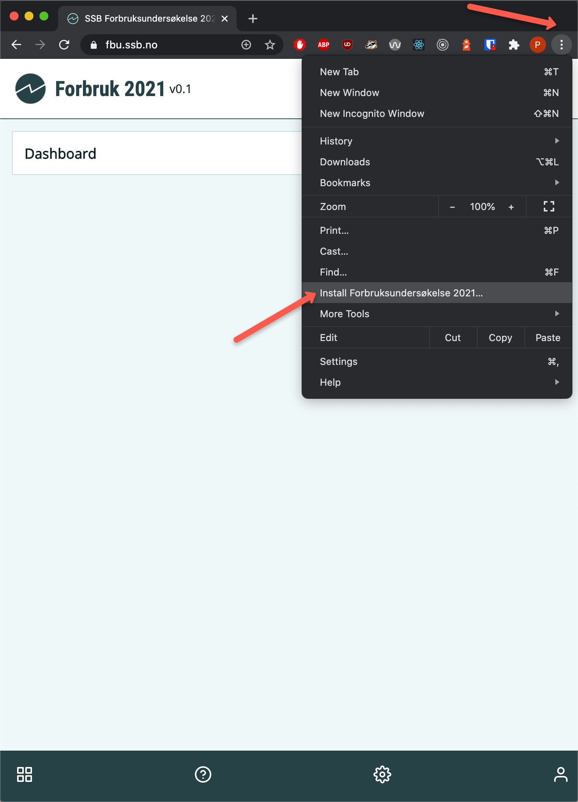

## React (Next.js) PWA PoC/Prototype for Forbruksundersøkele 2021

### Development
```bash
$ npm i
$ npm run dev
```

Point browser to http://localhost:3000

#### Pre-requisites for testing PWA functionality
1. [Docker](https://docs.docker.com/desktop/)
1. [Docker-compose](https://docs.docker.com/compose/install/)
1. Only PWAs that can be accessed over HTTPS can be installed as an "app"
1. Setup a temporary *.ssb.no dns entry (f.eks. fbu.ssb.no)
   - Mac/*nix based systems: add en entry in your /etc/hosts file
     ```bash
     $ sudo cat >> /etc/hosts
     127.0.0.1 fbu.ssb.no
     ```
   - For Windows 10, follow instructions provided [here](https://www.liquidweb.com/kb/edit-host-file-windows-10/)  
1. Run the app
   ```bash
   $ docker-compose up
   ```
1. Open http://fbu.ssb.no (or whatever name you setup in #3 above) in *Chrome*
1. You will now be able to install the application via 
   - 'Install Forbruksundersøkelse 2021' from the 
1. If you make any changes and have to test PWA functionality again, remember to rebuild the images
   ```bash
   $ docker-compose up --build   
   ```

----

### Accessing from a mobile device
1. You will have to install an app like [VpnHosts](https://play.google.com/store/apps/details?id=com.github.xfalcon.vhosts&hl=en) (android) on your mobile to map fbu.ssb.no to your IP address.
1. The format of the Hosts file is the same as /etc/hosts file  
1. Contact your project admin/devops for the url of the app. 
   - Ensure the app is accessible via a https:// url. 
1. Open the url in *Chrome* (Android) or *Safari* (iOS) and follow the instructions displayed on screen 
